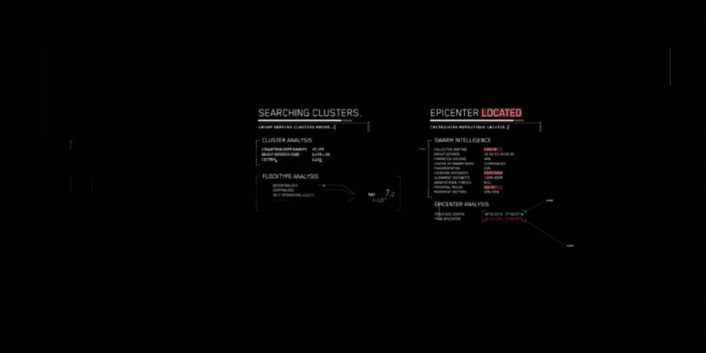

# 
# Olá, eu sou Kauã Kelvyn! 👋

## 🚀 Sobre mim

Sou um desenvolvedor Front-end apaixonado por criar experiências web intuitivas e dinâmicas. Atualmente, estou expandindo minhas habilidades para me tornar um desenvolvedor Full-Stack.

- 🌱 Atualmente estou aprendendo: Node.js, Express, MongoDB
- 💬 Pergunte-me sobre: HTML, CSS, JavaScript, React
- 📫 Como me encontrar: [kauakelvyn.dev1@gmail.com](kauakelvyn.dev1@gmail.com)
- 📝 Veja meu [LinkedIn](https://www.linkedin.com/in/kau%C3%A3-moraes-079288303/) para mais informações

## 🛠️ Tecnologias e Ferramentas

## 📊 Estatísticas do GitHub

## 🏆 Conquistas

## 📚 Projetos Recentes

- [Projeto 1](https://github.com/Kerubink/Projeto-M3---PDA-): Descrição do projeto 1.
- [Projeto 2](https://github.com/seu-usuario/projeto2): Descrição do projeto 2.
- [Projeto 3](https://github.com/seu-usuario/projeto3): Descrição do projeto 3.

## 🎯 Objetivos

- Completar um curso de Node.js até o final do ano
- Contribuir para projetos open-source
- Desenvolver uma aplicação full-stack completa

---

Obrigado pela visita! Se você tiver alguma dúvida ou quiser colaborar em algum projeto, sinta-se à vontade para entrar em contato! 😄

