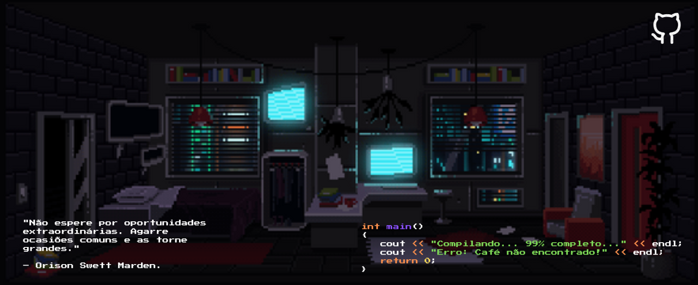

 
  

<b>Olá, eu sou Kauã Kelvyn!</b></h4>

Sou um **Desenvolvedor Fullstack** e **Estudante de Cyber Security**, apaixonado por tecnologia, inovação e segurança digital. Gosto de criar aplicações modernas e seguras, explorando o mundo da **segurança ofensiva e defesa de sistemas**. 

## ✨ Sobre mim  

  

💻 **Desenvolvimento Fullstack:** Crio **aplicações web escaláveis** com **React**, **Node.js**, **TypeScript**, **Tailwind CSS** e bancos de dados **SQL/NoSQL**.  

🔐 **Cyber Security:** Estudo **pentest**, **análise de vulnerabilidades** e **segurança de redes** para fortalecer sistemas.  

⚙️ **Tecnologias:** Experiência com **React**, **Node.js**, **Firebase** e bancos de dados **SQL/NoSQL**.  

🔎 **Análise de Segurança:** Realizo **testes de invasão** e estudo **engenharia reversa** para corrigir falhas em sistemas.  

🛡️ **Defesa de Sistemas:** Pesquiso **estratégias de mitigação** e protejo aplicações de ataques.  

🤖 **Automação:** Desenvolvo **scripts** para automatizar processos de pentest e otimizar fluxos de desenvolvimento.  

🎯 **Interesses:** **Desenvolvimento seguro**, **segurança ofensiva** e **engenharia reversa**.  

📚 **Estudos atuais:** Aperfeiçoando habilidades em **desenvolvimento fullstack** e **segurança ofensiva**.

  <h3 align="right"><b>✨ Conecte-se comigo:</b></h3>

  
  
  <!--  -->

 
<h2 align="center">🔥 Tecnologias & Ferramentas</h2>

### 🖥️ **Ferramentas de Desenvolvimento**

  

  

### 🔐 **Cyber Security & Hacking**

  
  
  
  
  
  
  
  
  
  
  
  
  

 
<h2 align="center">📊 GitHub Stats</h2>

  
  

 
<h2 align="center">☕ Buy Me a Coffee</h2>

  Se gosta do meu trabalho e quer apoiar meu aprendizado e projetos, você pode me dar um café! Isso me ajuda a continuar explorando desenvolvimento e segurança e criar mais conteúdos para a comunidade.  

  

<!-- 
## 📬 Entre em Contato  

Se quiser trocar uma ideia sobre **Desenvolvimento**, **Cyber Security** ou qualquer outro assunto tech, entre em contato comigo:  

📧 **Email:** [kauakelvyn.dev1@gmail.com](mailto:kauakelvyn.dev1@gmail.com)  
💼 **LinkedIn:** [Meu Perfil](https://www.linkedin.com/in/kau%C3%A3-moraes-079288303/)  
🐱 **GitHub:** [Kerubink](https://github.com/Kerubink)  
🐦 **Twitter/X:** [@kauakelvyn](https://twitter.com/kauakelvyn)   -->

 
 
 

  

