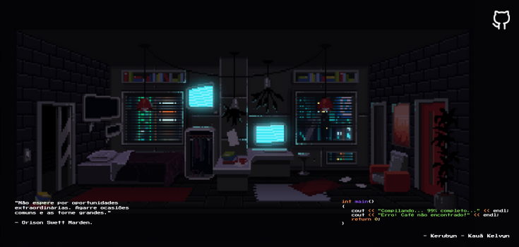

  

<h1 align="center" style="color: #6495ed; font-size: 36px; font-weight: 900;"><b>Kerubyn aqui ✨!</b></h1>

<b>Olá, eu sou Kauã Kelvyn!</b></h4>

Sou um **Desenvolvedor Fullstack** e **Estudante de Cyber Security**, apaixonado por tecnologia, inovação e segurança digital. Gosto de criar aplicações modernas e seguras, explorando o mundo da **segurança ofensiva e defesa de sistemas**. 

## 🛠️ Sobre mim   

  

💻 **Desenvolvimento Fullstack:** Crio **aplicações web completas**, com foco em **performance, escalabilidade e segurança**, utilizando **React, Node.js, TypeScript**, **Tailwind CSS** e bancos de dados **SQL/NoSQL**.  

🔐 **Cyber Security:** Estudo **pentest, análise de vulnerabilidades e segurança de redes**, aplicando conhecimentos para **fortalecer aplicações e sistemas**.  

⚙️ **Tecnologias:** Trabalho com **React**, **Node.js**, **Firebase**, e bancos de dados **SQL/NoSQL**, sempre buscando implementar soluções seguras e escaláveis.  

🔎 **Análise de Segurança:** Realizo **testes de invasão** e estudo técnicas de **engenharia reversa** para identificar e corrigir falhas de segurança em sistemas web.  

🛡️ **Defesa de Sistemas:** Pesquiso **estratégias de mitigação** e segurança de redes, buscando proteger as aplicações de ataques cibernéticos.  

🤖 **Automação:** Desenvolvo **scripts** para **automatizar processos** em pentest e análise de segurança, além de otimizar fluxos de desenvolvimento.  

🎯 **Interesses:** Tenho grande interesse em **desenvolvimento seguro**, **segurança ofensiva**, **engenharia reversa** e **melhoria contínua de sistemas**.  

📚 **Estudos atuais:** Aperfeiçoando habilidades tanto em **desenvolvimento fullstack** quanto em **segurança ofensiva**, **forense digital** e **testes de invasão**.

## 🔥 Tecnologias & Ferramentas  

### 🖥️ **Desenvolvimento Fullstack**

  
  
  
  
  
  
  
  
  
  
  

### 🔐 **Cyber Security & Hacking**

  
  
  
  
  
  
  

---

## ☕ Buy Me a Coffee  

Se gosta do meu trabalho e quer apoiar meu aprendizado e projetos, você pode me dar um café! Isso me ajuda a continuar explorando **desenvolvimento e segurança** e criar mais conteúdos para a comunidade.  

---

## 📬 Entre em Contato  

Se quiser trocar uma ideia sobre **Desenvolvimento**, **Cyber Security** ou qualquer outro assunto tech, entre em contato comigo:  

📧 **Email:** [kauakelvyn.dev1@gmail.com](mailto:kauakelvyn.dev1@gmail.com)  
💼 **LinkedIn:** [Meu Perfil](https://www.linkedin.com/in/kau%C3%A3-moraes-079288303/)  
🐱 **GitHub:** [Kerubink](https://github.com/Kerubink)  
🐦 **Twitter/X:** [@kauakelvyn](https://twitter.com/kauakelvyn)  

---

  

